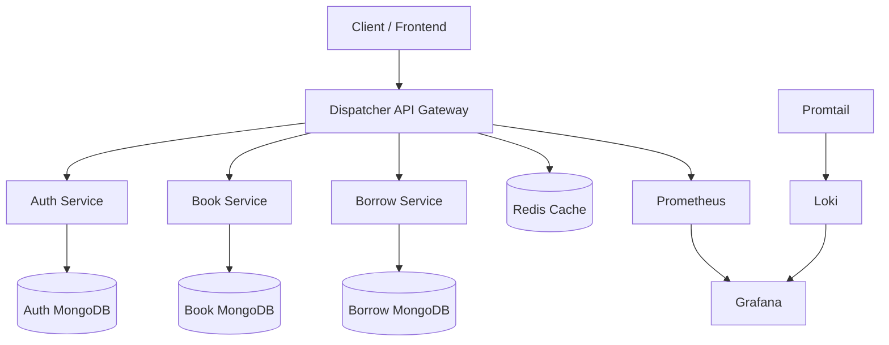

# Mikroservis Tabanlı Kütüphane Yönetim Sistemi

Bu proje, mikroservis mimarisi kullanılarak geliştirilmiş bir kütüphane yönetim sistemidir. Sistem; kullanıcı doğrulama, kitap yönetimi, ödünç alma işlemleri ve merkezi dispatcher servisi içermektedir.

## Sistem Mimarisi

---

## Kullanılan Teknolojiler

- Python (FastAPI)
- MongoDB
- Redis
- Docker & Docker Compose
- Prometheus
- Grafana
- Loki & Promtail
- k6 (Load Testing)

## Sistem İzleme ve Loglama

Sistem üzerinde çalışan dispatcher servisinden Prometheus metrikleri toplanmış ve Grafana ile görselleştirilmiştir.

Ayrıca container logları Promtail aracılığıyla toplanarak Loki üzerinde saklanmış ve Grafana üzerinden tablo formatında görüntülenmiştir.

## Görseller

### Grafana - İstek Grafiği

### Loki - Log Tablosu

## Performans ve Yük Testi

Sistem k6 aracı kullanılarak test edilmiştir. Test sırasında kullanıcı sayısı kademeli olarak artırılmıştır.

- Toplam istek: ~14,000
- Ortalama yanıt süresi: ~240 ms
- Hata oranı: %0.00

Yapılan testlerde sistemin yüksek yük altında stabil çalıştığı gözlemlenmiştir.

